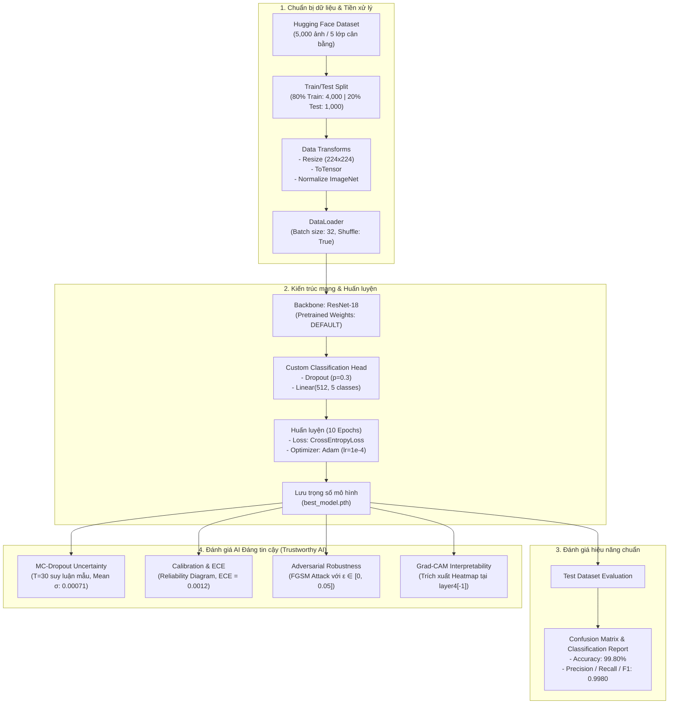
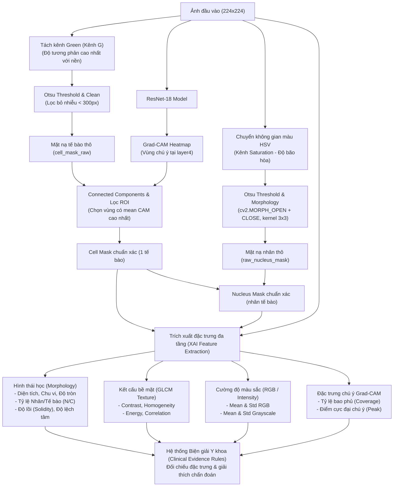

# Trustworthy AI - Blood Cell Classification & XAI

Dự án phân loại và giải thích AI (XAI) cho hình ảnh tế bào máu, bao gồm phân tích hình thái tế bào (Morphology), cấu trúc bề mặt (Texture), cường độ màu sắc (Intensity/RGB) và bản đồ nhiệt chú ý của mô hình AI (Grad-CAM).

## Cấu trúc thư mục (Tham khảo)
- `train/inference.py`: Ứng dụng web Streamlit cho phép người dùng tải ảnh lên, xem dự đoán của AI và giải thích chi tiết (bằng chứng hình thái).
- `train/tune_xai_extractor.py`: Script để tinh chỉnh và kiểm tra trực quan các thuật toán phân vùng tế bào (segmentation) và Grad-CAM.
- `train/xai_extractor.py`: Chứa logic trích xuất đặc trưng (diện tích, độ tròn, tỷ lệ nhân/tế bào, GLCM, v.v.) và biện giải tự động (evidence).
- `train/best_model.pth`: Trọng số của mô hình ResNet18 đã được huấn luyện.

## 1. Yêu cầu hệ thống (Requirements)

Đảm bảo bạn đã cài đặt Python (khuyến nghị 3.8 - 3.12). Bạn có thể cài đặt các thư viện cần thiết thông qua `pip` bằng các lệnh sau:

```bash
pip install torch torchvision
pip install opencv-python
pip install scikit-image
pip install streamlit
pip install matplotlib
pip install numpy
pip install Pillow
```

*(Gợi ý: Bạn có thể lưu danh sách trên vào file `requirements.txt` và cài đặt một lần bằng `pip install -r requirements.txt`)*

## 2. Cách tải và chuẩn bị Dataset

Dataset sử dụng trong bài thực hành là tập ảnh tế bào máu với 5 phân lớp chính:
- `basophil` (Bạch cầu ưa kiềm)
- `erythroblast` (Hồng cầu có nhân)
- `monocyte` (Bạch cầu hạt / Đại thực bào)
- `myeloblast` (Nguyên tủy bào)
- `seg_neutrophil` (Bạch cầu đoạn trung tính)

**Cách chuẩn bị:**
1. Bạn có thể sử dụng các dataset tế bào máu công khai trên Kaggle (ví dụ: PBC dataset, Blood Cell Images) có chứa các loại tế bào trên.
2. Tạo một thư mục `datasets/images_full` trong thư mục gốc của dự án.
3. Giải nén ảnh và phân bổ vào 5 thư mục con tương ứng với 5 nhãn.

*Cấu trúc thư mục mong đợi:*
```text
datasets/
└── images_full/
    ├── basophil/
    │   ├── img_1.jpg
    │   └── ...
    ├── erythroblast/
    ├── monocyte/
    ├── myeloblast/
    └── seg_neutrophil/
```

## 3. Xây dựng mô hình & Phương pháp phân biệt bằng XAI

Phần này mô tả chi tiết quy trình huấn luyện mô hình phân loại tế bào máu (theo file `code/only-image-no-maskv3.ipynb - Colab.pdf`), các đánh giá AI Đáng tin cậy (Trustworthy AI) và phương pháp phân tách, phân biệt các dòng tế bào bằng Explainable AI (theo file `train/tune_xai_extractor.py` & `train/xai_extractor.py`).

---

### 3.1. Sơ đồ và Quy trình xây dựng mô hình (Model Pipeline & Trustworthy AI)

Mô hình phân loại sử dụng kiến trúc **Transfer Learning với ResNet-18**, được huấn luyện và đánh giá toàn diện trên 5 phân lớp tế bào máu ung thư và bất thường huyết học.

#### Sơ đồ quy trình xây dựng & đánh giá mô hình:



#### Chi tiết các bước thực hiện:

1. **Tập dữ liệu huấn luyện:**
   - Nguồn dữ liệu: `electricsheepafrica/Africa-Blood-Cell-Images-and-EHR-for-Cancer-Detection` từ Hugging Face Hub (5,000 ảnh tế bào máu, 1,000 ảnh/lớp).
   - 5 lớp phân loại: `basophil`, `erythroblast`, `monocyte`, `myeloblast`, `seg_neutrophil`.
   - Phân chia: 80% tập huấn luyện (4,000 ảnh) và 20% tập kiểm thử (1,000 ảnh), cố định `seed=42`.
   - Chuẩn hóa: Kích thước $(224 \times 224)$, chuẩn hóa theo giá trị trung bình $\mu=[0.485, 0.456, 0.406]$ và độ lệch chuẩn $\sigma=[0.229, 0.224, 0.225]$.

2. **Kiến trúc mô hình & Tinh chỉnh (Fine-tuning):**
   - Mạng trích xuất đặc trưng nền tảng: **ResNet-18** (chứa 4 khối Residual block).
   - Tùy biến lớp phân loại cuối (`model.fc`):
     ```python
     model.fc = nn.Sequential(
         nn.Dropout(0.3),
         nn.Linear(model.fc.in_features, 5)
     )
     ```
   - Cấu hình huấn luyện: 10 Epochs, hàm mất mát `CrossEntropyLoss()`, thuật toán tối ưu `Adam` với `learning_rate = 1e-4`.

3. **Kết quả thực nghiệm trên tập Test (1,000 ảnh):**
   - **Độ chính xác toàn diện (Accuracy):** **99.80%** (Dự đoán chính xác 998/1000 ảnh).
   - **Bảng chi tiết chỉ số từng lớp:**

     | Lớp tế bào (Class) | Precision | Recall | F1-Score | Số mẫu hỗ trợ (Support) |
     | :--- | :---: | :---: | :---: | :---: |
     | **basophil** | 1.0000 | 0.9949 | 0.9974 | 196 |
     | **erythroblast** | 1.0000 | 1.0000 | 1.0000 | 197 |
     | **monocyte** | 0.9950 | 1.0000 | 0.9975 | 200 |
     | **myeloblast** | 0.9952 | 1.0000 | 0.9976 | 208 |
     | **seg_neutrophil** | 1.0000 | 0.9950 | 0.9975 | 199 |
     | **Trung bình Macro** | **0.9980** | **0.9980** | **0.9980** | **1,000** |

4. **Các trụ cột Đánh giá AI Đáng tin cậy (Trustworthy AI Pillars):**
   - **Độ bất định (Uncertainty Estimation - MC Dropout):** Kích hoạt lớp Dropout tại thời điểm suy luận (Inference time) với $T=30$ vòng lặp Monte Carlo. Độ lệch chuẩn xác suất trung bình trên tập kiểm thử chỉ đạt **0.00071** (cực đại 0.0877), chứng minh mô hình có độ ổn định và độ tin cậy vượt trội.
   - **Độ hiệu chuẩn mô hình (Model Calibration & ECE):** Vẽ biểu đồ độ tin cậy (Reliability Diagram) và tính sai số hiệu chuẩn kỳ vọng **ECE = 0.0012** (Expected Calibration Error). Chỉ số gần như bằng 0 chứng minh mức độ tự tin (Confidence score) phản ánh trực tiếp xác suất chính xác thực tế.
   - **Độ bền vững trước tấn công đối kháng (Adversarial Robustness - FGSM):** Thực nghiệm tấn công Fast Gradient Sign Method với các cường độ nhiễu $\epsilon$:
     - $\epsilon = 0.000$: Accuracy = 99.80%
     - $\epsilon = 0.005$: Accuracy = 95.20%
     - $\epsilon = 0.010$: Accuracy = 87.70%
     - $\epsilon = 0.020$: Accuracy = 72.60%
     - $\epsilon = 0.050$: Accuracy = 50.20%
   - **Bản đồ nhiệt Grad-CAM (Gradient-weighted Class Activation Mapping):** Trích xuất gradient và activation tại lớp `layer4[-1]` để trực quan hóa vùng mô hình tập trung chú ý khi đưa ra quyết định.

---

### 3.2. Phương pháp phân biệt tế bào bằng XAI (Explainable AI & Feature Extraction)

Kỹ thuật trong `tune_xai_extractor.py` và `xai_extractor.py` kết hợp xử lý thị giác máy tính truyền thống (Computer Vision) với bản đồ nhiệt Deep Learning (Grad-CAM) để cô lập tế bào mục tiêu, trích xuất đặc trưng hình thái - kết cấu và đưa ra biện giải y khoa tự động.

#### Sơ đồ quy trình bóc tách và phân biệt bằng XAI:



#### Các kỹ thuật xử lý cốt lõi:

1. **Bóc tách đa kênh chuyên biệt (Multi-channel Segmentation):**
   - **Kênh Green (Kênh G) cho màng tế bào:** Kênh G có độ hấp thụ ánh sáng và tương phản mạnh nhất giữa viền tế bào và tiêu bản nền $\rightarrow$ Áp dụng ngưỡng Otsu để tạo `cell_mask`.
   - **Kênh HSV - Saturation (Độ bão hòa) cho nhân tế bào:** Thuốc nhuộm Giemsa làm nhân tế bào bắt màu tím đậm có độ bão hòa màu vượt trội so với bào tương $\rightarrow$ Áp dụng ngưỡng Otsu trên kênh Saturation kết hợp đóng/mở hình thái học (Morphological Open/Close) để làm mượt đường biên nhân.

2. **Lọc tế bào mục tiêu bằng Grad-CAM (Target Cell Isolation via Attention ROI):**
   - Tiêu bản lam máu thường chứa nhiều hồng cầu hoặc tạp chất xung quanh tế bào bạch cầu chính.
   - Script sử dụng `cv2.connectedComponentsWithStats` để đánh số tất cả các cụm đối tượng tách rời.
   - Tính giá trị Grad-CAM trung bình trên từng cụm:
     $$\text{mean\_cam} = \frac{1}{|R_i|} \sum_{(x,y) \in R_i} \text{CAM}(x, y)$$
   - Chỉ giữ lại cụm đối tượng có điểm chú ý Grad-CAM cao nhất. Điều này bảo đảm việc tính toán đặc trưng tập trung 100% vào tế bào mà mô hình AI đang chẩn đoán:
     $$\text{Cell Mask} = (\text{labels} == \text{best\_label})$$
     $$\text{Nucleus Mask} = \text{Raw Nucleus Mask} \cap \text{Cell Mask}$$

3. **Hệ thống đặc trưng định lượng (Quantitative Features):**
   - **Hình thái tế bào & nhân (Morphology):**
     - Diện tích (`Area`), Chu vi (`Perimeter`).
     - Độ tròn (`Circularity` $= \frac{4\pi \times \text{Area}}{\text{Perimeter}^2}$).
     - Độ đầy đặn/lồi (`Solidity` $= \frac{\text{Area}}{\text{ConvexArea}}$).
     - Độ lệch tâm (`Eccentricity`).
     - Tỷ lệ Nhân / Tế bào (`Nucleus-to-Cell Ratio` - N/C Ratio).
   - **Kết cấu bề mặt (Texture via GLCM - Gray-Level Co-occurrence Matrix):**
     - Độ tương phản (`Contrast`), Độ đồng nhất (`Homogeneity`), Năng lượng kết cấu (`Energy`), Hệ số tương quan (`Correlation`).
   - **Cường độ & Màu sắc (Color & Intensity):**
     - Giá trị trung bình và độ lệch chuẩn của các kênh R, G, B và thang xám Grayscale.
   - **Đặc trưng tập trung chú ý (Grad-CAM Metrics):**
     - Diện tích vùng chú ý (`Attention Area`), Tỷ lệ bao phủ tế bào (`Attention Coverage` $= \frac{\text{Attention Area}}{\text{Cell Area}}$), Giá trị chú ý cực đại (`Attention Peak`).

4. **Bộ quy tắc biện giải y khoa để phân biệt 5 dòng tế bào (Evidence-based Clinical Rules):**

Dựa vào các chỉ số trích xuất định lượng, thuật toán đối chiếu với các đặc điểm bệnh học huyết học để đưa ra giải thích tường minh:

| Loại tế bào (Class) | Đặc trưng cốt lõi (Core Features) | Ngưỡng định lượng XAI (Quantitative Rules) | Cơ sở biện giải Y khoa (Clinical Interpretation) |
| :--- | :--- | :--- | :--- |
| **Bạch cầu đoạn trung tính**<br/>(`seg_neutrophil`) | Nhân phân thùy thắt đoạn,<br/>Bào tương nhiều hạt mịn | • `nucleus_circularity < 0.60`<br/>• `contrast > 100` hoặc `energy < 0.15` | Nhân có độ tròn rất thấp do phân chia nhiều múi/đoạn; Tương phản GLCM cao và năng lượng thấp phản ánh cấu trúc hạt mịn phân tán dày đặc. |
| **Bạch cầu ưa kiềm**<br/>(`basophil`) | Hạt kiềm thô to dày đặc che lấp nhân | • `contrast > 130`<br/>• `homogeneity < 0.35`<br/>• `std_intensity > 35` | Các hạt sắc tố kiềm tính kích thước lớn gây nhiễu loạn bề mặt cực mạnh, làm tăng vọt độ tương phản GLCM và độ lệch chuẩn độ sáng. |
| **Bạch cầu đơn nhân**<br/>(`monocyte`) | Kích thước đại thực bào lớn,<br/>Màng giả túc, nhân hình đậu | • `cell_area > 4000 px`<br/>• `cell_solidity < 0.92`<br/>• `nucleus_circularity < 0.58` | Kích thước lớn nhất trong các dòng bạch cầu; Độ đầy đặn viền thấp do màng tế bào tạo chân giả nhấp nhô (amoeboid); Nhân gập khúc có nếp khuyết sâu. |
| **Nguyên tủy bào - Tế bào non ác tính**<br/>(`myeloblast`) | Tế bào non đầu dòng,<br/>Nhân khổng lồ, viền tròn căng | • `nucleus_ratio > 0.65`<br/>• `cell_solidity > 0.95`<br/>• `homogeneity > 0.40` hoặc `energy > 0.20` | Tỷ lệ Nhân/Tế bào rất cao (nhân chiếm gần như toàn bộ tế bào); Viền lồi tròn đều; Chất nhiễm sắc mịn màng, bào tương thuần nhất chưa biệt hóa tạo hạt. |
| **Hồng cầu có nhân**<br/>(`erythroblast`) | Cấu trúc hình cầu đồng tâm,<br/>Nhân tròn đặc | • `nucleus_circularity > 0.80`<br/>• `cell_circularity > 0.80`<br/>• `cell_eccentricity < 0.40` | Nhân tế bào tròn đặc vô định hình; Cả nhân và toàn thể tế bào đều có độ tròn cao tiệm cận tuyệt đối và độ lệch tâm rất thấp (dạng hình cầu tròn trơn láng). |

- **Đánh giá vùng chú ý Grad-CAM:**
  - `Attention Coverage > 60%`: Mô hình xem xét toàn diện cả cấu trúc nhân và bào tương để kết luận.
  - `30% <= Attention Coverage <= 60%`: Mô hình dồn trọng số vào các vùng đặc hiệu cục bộ (đường biên nhân hoặc các hạt sắc tố).
  - `Attention Coverage < 30%`: Cảnh báo vùng chú ý bị co hẹp hoặc bị nhiễu bởi dị vật vi thể ngoại lai.

---

## 4. Cách sử dụng (Usage)

### 4.1. Chạy Web App phân tích tế bào (Streamlit Inference)
Để mở giao diện trực quan hóa và giải thích các đặc trưng mà mô hình AI đã trích xuất, chạy lệnh sau tại thư mục gốc:

```bash
streamlit run train/inference.py
```
Ứng dụng sẽ mở trên trình duyệt (thường ở địa chỉ `http://localhost:8501`). Từ đây, bạn có thể upload một ảnh tế bào máu bất kỳ từ máy tính để hệ thống AI đưa ra chẩn đoán và tự động giải thích dựa trên đặc điểm hình thái và Grad-CAM.

### 4.2. Chạy Script tinh chỉnh phân vùng & Grad-CAM
Script `tune_xai_extractor.py` cho phép bạn tinh chỉnh và kiểm tra mắt nhìn từng bước bóc tách tế bào bằng kênh màu (Kênh Green cho màng tế bào, Kênh HSV-Saturation cho nhân tế bào).

- Chạy thử nghiệm tự động bằng một ảnh ngẫu nhiên trong Dataset:
  ```bash
  python train/tune_xai_extractor.py
  ```
- Hoặc truyền trực tiếp đường dẫn của một ảnh cụ thể mà bạn muốn phân tích:
  ```bash
  python train/tune_xai_extractor.py "path/to/your/image.jpg"
  ```
Sau khi chạy, một cửa sổ giao diện sẽ hiện ra liệt kê chuỗi 7 biểu đồ phân tích từ ảnh gốc, ảnh trích xuất màu, ảnh mặt nạ tế bào, mặt nạ nhân, đến bản đồ nhiệt Grad-CAM và kết quả chồng lấp (overlay viền tế bào và nhân).
